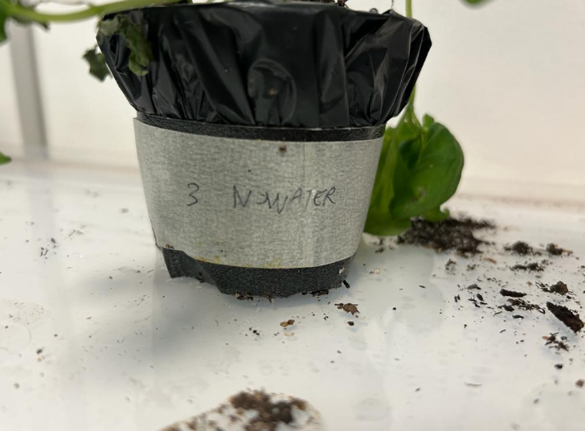
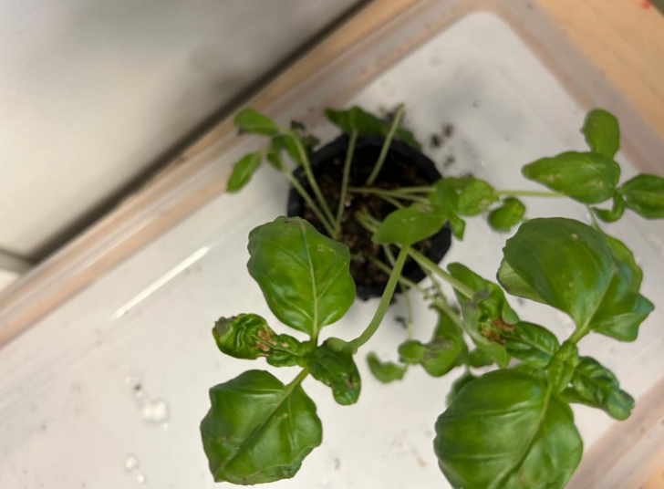
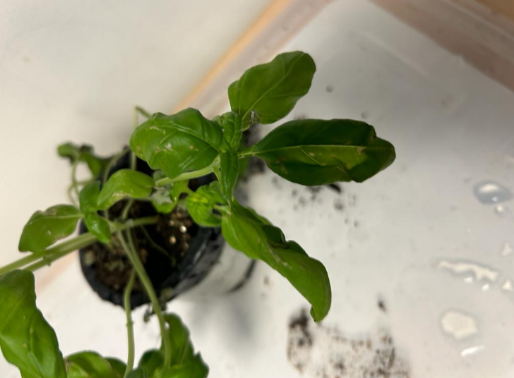
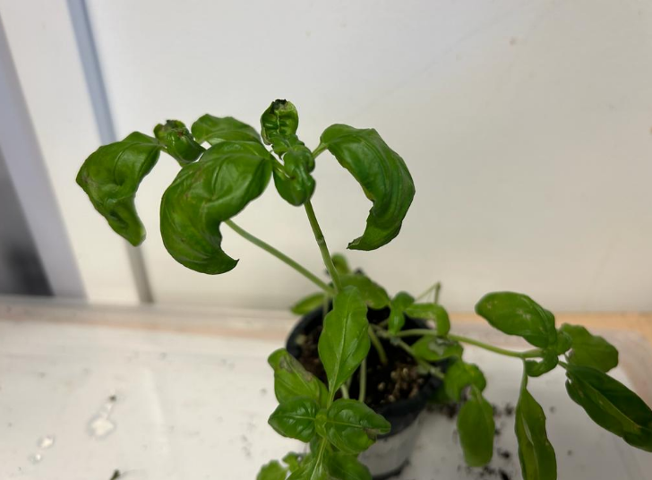
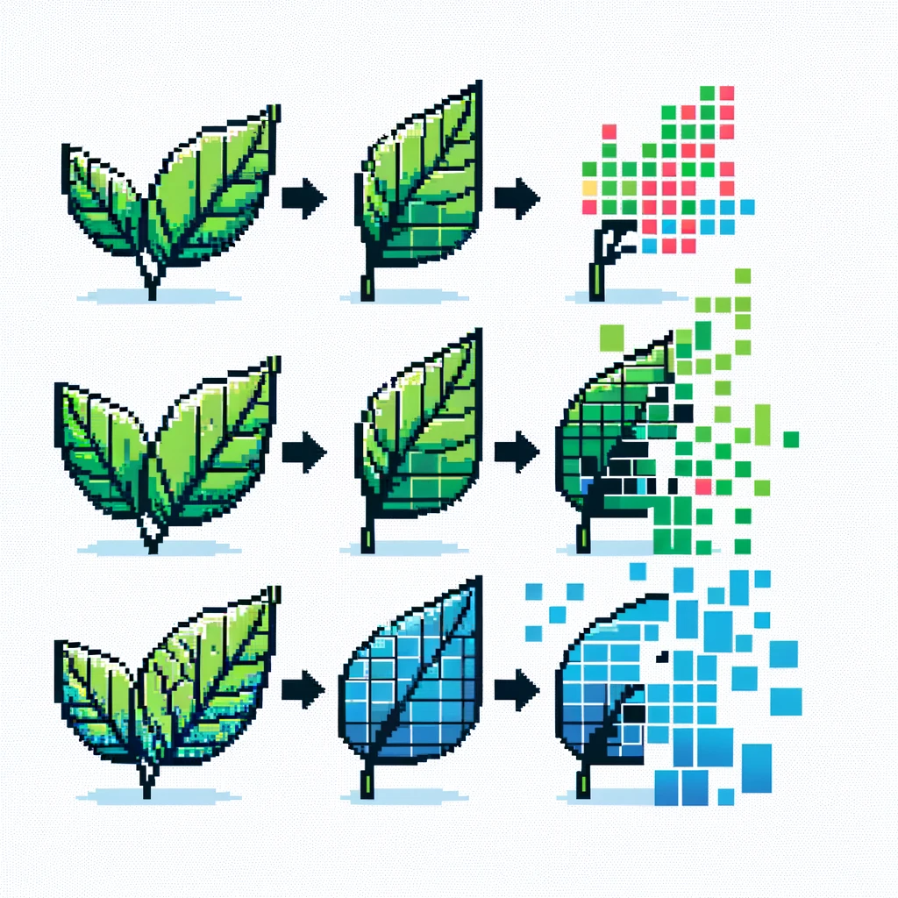
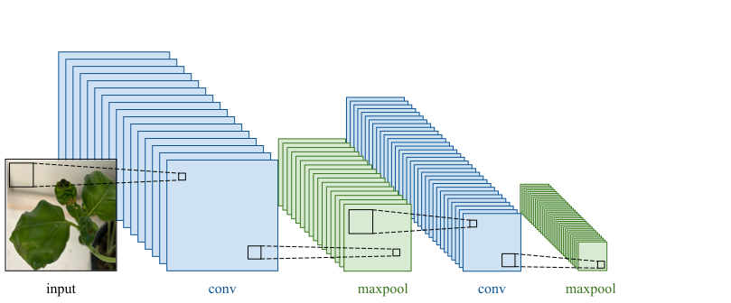
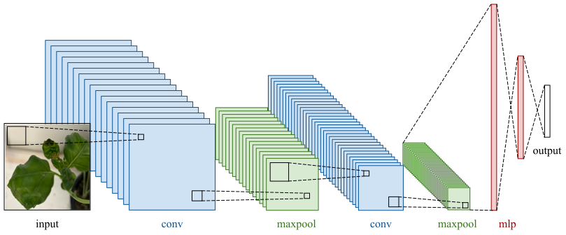
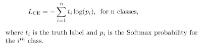
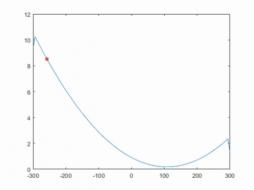

## Abstract

Plant diseases pose a significant problem for agriculture, especially considering the increasing pressure caused by climate change on plants, exposing them to new stressors. These stresses can be triggered by factors like drought, flooding, extreme temperatures, and alterations in soil composition. Within agriculture, these stresses can lead to production losses, decreased product quality, and even plant mortality. Early detection of diseases is crucial to enable farmers to address them before they cause substantial damage.

The use of deep learning, a subset of artificial intelligence (AI), emerges as an effective solution for detecting these plant diseases. By employing Convolutional Neural Networks (CNNs), these networks can identify intricate patterns within images, making them ideal for pinpointing disease symptoms on plant leaves with high precision.

This paper introduces a method for early detection of plant diseases based on deep learning. The aim of this method is to be accessible and user-friendly for farmers. To achieve this goal, the method will be implemented as a web application accessible via a smartphone or tablet equipped with a camera, making this technology available to a larger number of farmers without requiring additional hardware.

In this study, we will conduct experiments on basil plants subjected to various stresses. We will simulate a range of conditions such as drought, flooding, and alterations in soil composition. Photos of the plant leaves at different stress stages will be taken. Subsequently, our deep learning model will be used to predict the type of stress experienced by the plants.

We hope this experiment will demonstrate that our model can accurately predict the stress experienced by the plants before it becomes visible to the naked eye. This capability could enable farmers to take preventive measures to safeguard their crops.

## Introduction
Plant diseases pose a significant challenge to global agriculture, causing substantial losses in production and quality, and even leading to crop failure. The increasing pressure of climate change on plants further exacerbates the issue, exposing them to a wider range of stressors, such as drought, flooding, extreme temperatures, and soil composition changes. These stresses can manifest as visible symptoms on plant leaves, but detection at early stages is crucial for prompt intervention.

Deep learning, a subset of artificial intelligence (AI), has emerged as a powerful tool for early detection of plant diseases. Convolutional Neural Networks (CNNs), a type of deep learning architecture, excel at identifying subtle patterns in images, making them well-suited for pinpointing disease symptoms on plant leaves.

This paper proposes a web application that utilizes deep learning to enable farmers to detect plant diseases early on. The application will be accessible via smartphones or tablets equipped with cameras, making it convenient and accessible to a wider range of farmers.

To evaluate the effectiveness of our method, we will conduct experiments on basil plants subjected to various stresses. We will simulate a range of conditions, including drought, flooding, and alterations in soil composition. Photographs of the plant leaves will be taken at different stress stages. Our deep learning model will then be used to predict the type of stress experienced by the plants.

We anticipate that our deep learning model will accurately predict the stress experienced by the plants even before it becomes visible to the naked eye. This capability would empower farmers to take preventive measures, such as adjusting irrigation schedules or modifying soil nutrients, to protect their crops and minimize losses.

This study has the potential to change the way farmers manage plant diseases, significantly reducing crop losses and improving agricultural productivity. The web application's ease of use and accessibility will make it a valuable tool for farmers worldwide.

Several studies have demonstrated the effectiveness of deep learning for early detection of plant diseases. For instance, Ghasemi et al. (2020) developed a CNN-based model for identifying citrus diseases, achieving an accuracy of over 90%. Similarly, Zhang et al. (2022) employed a deep learning model for detecting rice diseases, achieving a precision of 93.4%.

Our work builds upon these advancements by developing a user-friendly web application for farmers, making deep learning accessible to a wider audience. We aim to address the gap in existing research by demonstrating the ability of our model to predict stress conditions before they manifest as visible symptoms on plant leaves.

## State of the art

### Plant Disease Detection
Effective plant disease detection techniques can be classified into two main categories: non-destructive and destructive techniques.

#### Non-destructive Techniques
- Visual inspection: It involves visually examining plants either with the naked eye or using a camera. This technique is simple and cost-effective but can be subjective and requires human expertise.
- Infrared-based detection: It utilizes differences in infrared reflectance between healthy and diseased tissues. While more objective than visual detection, it requires specialized equipment.
- Spectroscopy: By measuring light absorption in plants, this technique identifies diseases precisely. However, it necessitates expensive equipment.

#### Destructive Techniques
- Microscopy: It allows the observation of disease symptoms at a microscopic level. Though highly accurate, it requires expertise and can be destructive to plants.
- Biochemical tests: These measure chemical concentrations in plant tissues. While quick and inexpensive, they might lack specificity for diseases.

### NDVI and PRI Indices
NDVI (Normalized Difference Vegetation Index): It uses the difference between near-infrared (NIR) and red wavebands to assess plant health. Higher NDVI values indicate healthier plants due to the way healthy plants absorb and reflect light differently from stressed or damaged ones.

PRI (Photochemical Reflectance Index): It gauges plant health by comparing light reflectance at specific wavelengths (531 nm and 570 nm) to estimate chlorophyll content, crucial for photosynthesis and closely correlated with plant health.

Both NDVI and PRI indices are calculated using light reflectance data collected by sensors, often from satellites, airplanes, or drones. However, these means of data collection can be costly for farmers or operators.

<p align="center">
  
</p>

### CNNs and Computer Vision
Convolutional Neural Networks (CNNs) are a type of artificial neural network widely used in computer vision. CNNs excel at image processing by learning to recognize patterns in data. They are applied in image classification, object detection, and image segmentation.

To extract features from an image, a CNN consists of:

1. Convolutional layers: These layers apply filters (kernels) to extract features through convolution operations, identifying specific patterns like edges, textures, or shapes.

2. Pooling layers: Also known as subsampling layers, they reduce spatial dimensionality by selecting the most important features extracted by convolutional layers, often through operations like max pooling or averaging.

#### Network Architectures
Architectures like LeNet, AlexNet, VGG, GoogLeNet (Inception), ResNet, and EfficientNet are commonly used CNN architectures, each with its depth, complexity, and performance characteristics.

Specifically, ResNet introduced residual connections in 2015, addressing the degradation problem in deeper networks by allowing the addition of residual blocks.

#### Transfer Learning
This technique involves using pre-trained models on large datasets like ImageNet. Pre-trained layers can be reused for similar tasks, yielding good results even with smaller datasets.

#### Enhancements and Regularizations
Batch Normalization, Dropout, and data augmentation techniques such as rotation, horizontal/vertical flipping, random cropping, etc., are often used to improve model generalization and prevent overfitting.

<p align="center">
  
</p>

## Experimentation Process

The research process on early detection of plant diseases addresses two major objectives:

Development of a deep learning model capable of detecting plant diseases at an early stage, before symptoms are visible to the naked eye.

Evaluation of the accuracy and robustness of the model under various conditions, including drought, flooding, and changes in soil composition.

### Experimental Equipment
The equipment required for the research includes:

- An iPhone 14 equipped with a dual 12 MP primary camera for image capture.
- BAsilic basilicum plants that is the most common variety known for disease resistance, source from commercial nurseries to ensure consistency
- Nvidia GeForce GTX 4060 Ti GPU with 8GB dedicated memory for training the deep learning model.
- Niello L-LZB1 agricultural LED lamp providing a full-spectrum light, crucial for indoor plant growth and consistent light exposure.

### Protocol to Collect Data

#### Plant Preparation and Growth

The basil plants are divided into four groups, each to be subjected to different stress conditions, such as drought, flooding, and alterations in soil composition.
This aims to observe plant reactions and symptoms under stress compared to a control group grown under ideal conditions.

Thus have been grown under identical conditions, using nutrient-rich soil. This approach aims to minimize growth differences by ensuring a uniform growing environment.

The four groups are structured as follows:

- Group 1: Control Group - This group is intended to provide reference images of healthy plants. Basil, being a summer plant, requires substantial water input, so the substrate must remain moist. Thus, daily watering will be performed in the morning at 9 o'clock. Additionally, this plant requires approximately 16 hours of sunlight exposure per day. Hence, the grow light will be turned on to meet this light exposure duration, ensuring the best conditions for this experimental group.

- Group 2: Drought-Induced Group - This group aims to simulate increasingly common drought conditions encountered in crops due to climate change. To replicate this drought, all water supply to the plants will be halted while maintaining the same lighting pattern as the control group.

- Group 3: Soil Composition Alteration Group - The goal here is to simulate soil disturbance. To achieve this, the focus will be on an excessive supply of chelated iron. A solution containing 5 grams of chelated iron diluted in 1 liter of water will be administered daily via drip irrigation to this experimental group, representing five times the recommended dose. This surplus of iron can lead to growth problems, particularly due to the potential toxicity of iron to plants. Water and light supply will remain identical to those of the control group to maintain uniform environmental conditions between experimental groups.

- Group 4: Excessive Watering Group - In this group, irrigation will be tripled compared to the control group, inducing waterlogging to simulate plant drowning. Light exposure will remain similar to that of the control group to maintain consistent lighting conditions.

<p align="center">
  
</p>


#### Data Collection

This phase involves capturing images of basil plants at various stages of their growth. 

- Photography Schedule: Images of the basil plants were systematically captured at predefined times (9 AM, 12 PM, and 5 PM) to maintain consistency in lighting and minimize external variables.

- Standard Distance: A standard distance of 10 cm was maintained from the plants during image capture to ensure consistency in the scale of photographs.

- Multiple Angles: Plants' images were taken from various angles to capture a comprehensive view of all symptoms and plant characteristics.

<p align="center">
  
  
  
  
</p>

### Development of the application

### Data preparation

In the field of deep learning, data preparation is a crucial step. We explore how to load data from a specific dataset, apply data augmentation techniques, and then convert them into tensors for use with PyTorch. We use a dataset of leaves from this Kaggle contest: https://www.kaggle.com/competitions/plant-pathology-2020-fgvc7/overview.

#### Data loading

Data loading begins with initializing the LeafDataset class, which inherits from PyTorch's Dataset. This step is essential for efficient and structured data manipulation.

```python
class LeafDataset(Dataset):
```

In this class's constructor, we load different images from the "dataset/plant-pathology-2020-fgvc7" folder, containing all training and testing images. The labels associated with these images ['healthy', 'scab', 'rust', 'multiple diseases'] are stored in a CSV file named "train.csv", which we also load as dataframe_Y.

```python
self.path = "dataset/plant-pathology-2020-fgvc7"
self.path_dir_X = os.path.join(self.path, 'image')
self.path_Y = os.path.join(self.path, 'train.csv')
self.dataframe_Y = pd.read_csv(self.path_Y)
self.labels = self.dataframe_Y.loc[:, 'healthy':'scab']
```

#### Data augmentation

Data augmentation is a technique to artificially increase the diversity of training data by randomly and realistically transforming them. This improves model generalization to avoid overfitting on the same photos.

Applied Techniques:

For applying these techniques, we use the albumentations library.
```python
import albumentations as A
```

- RandomResizedCrop: This transformation randomly changes the size and proportions of the image. Here, we resize the images to a defined size for consistency.
```python
A.RandomResizedCrop(height=height_image, width=width_image, p=1.0)
```
- Rotates the image by a random degree to simulate different orientations.
```python
A.Rotate(20, p=1.0)
```
- Flip & Transpose: Applies horizontal and/or vertical flipping, and transposes the images, increasing the variability of orientations and perspectives.
```python
A.Flip(p=1.0)
A.Transpose(p=1.0)
```
- Normalize: Normalizes the images to speed up convergence during training by standardizing pixel values.

```python
A.Normalize(p=1.0),
```

<p align="center">
  
</p>

#### Conversion to Tensor

Converting to tensors is a fundamental step for using PyTorch. Tensors are multi-dimensional data structures optimized for GPU computations, significantly accelerating model training.

Furthermore, tensors allow for efficient use of PyTorch's advanced features, such as automatic backpropagation for gradient calculation.

```python
from albumentations.pytorch import ToTensorV2

ToTensorV2(p=1.0)
```

<p align="center">
  
</p>

#### Retrieving Transformed Images

The __getitem__ method is called each time an element of the dataset is accessed by an index - playing a crucial role in integrating the dataset with the PyTorch ecosystem, particularly with DataLoader for loading and manipulating data during model training.

This method thus returns an image and its associated label based on an index.

```python
def __getitem__(self, index):
    img_name = self.dataframe_Y.loc[index, 'image_id']  
    img_path = f"{self.path_dir_X}/{img_name}.jpg"
    image = plt.imread(img_path
    image = self.transform(image = image)['image']
    label = torch.tensor(np.argmax(self.labels.loc[index,:].values))  #
    return image, label
```

### Model

#### Functioning of a CNN

A CNN, or Convolutional Neural Network, is a powerful deep learning technique primarily used for computer vision, especially in image recognition. The fundamental idea behind CNNs is to simulate how the human brain visually processes information.

- Input: A CNN takes an image as input, essentially a grid of pixels, each with color values (red, green, blue).

- Filters: CNNs use filters (or kernels) to extract important features from the image. These filters are small matrices (e.g., 3x3 or 5x5) that move across the entire image. At each position, the filter performs a convolution operation that combines pixel values in its coverage area.

- Feature Maps: The convolution operations create feature maps, essentially modified images. Each feature map highlights a specific image feature, such as edges, corners, or more complex patterns.

- Pooling Layers: To reduce the size of the feature maps and make the model more efficient, pooling layers are used. They reduce the resolution of the feature maps while retaining essential information, typically taking the maximum (max-pooling) or average (average-pooling) value in a small region of the feature map.

<p align="center">
  
</p>

#### Fine-Tuning

Fine-tuning is a transfer learning technique that involves using a pre-trained model for a specific task as a starting point for a model intended for another task. This approach offers several advantages, including improved final classification performance. ResNet-18, part of the ResNet family, was initially developed by Microsoft Research and trained on the ImageNet dataset, which contains over a million images in more than a thousand different categories. This allowed ResNet-18 to learn general features from a vast and diverse dataset.

In the fine-tuning process, the early layers of the pre-trained model are frozen, meaning their weights are not adjusted during the training phase. These layers have already acquired the skill to extract general image features.

We will use ResNet-18 for this fine-tuning part, replacing the CNN layer.

ResNet-18 is a highly popular deep neural network architecture, belonging to the family of residual networks (ResNets). It was introduced by Microsoft Research in 2015.

ResNet-18 consists of 18 layers of convolution, normalization operations, and pooling layers. It is a deep architecture, but lighter than other ResNet variants.

<p align="center">
  
</p>

#### Fully Connected layer

After the image passes through the convolutional and pooling layers, the fully connected (or dense) layers play a crucial role in the final classification in Convolutional Neural Networks (CNN).

##### Perceptron Concept

Fully connected layers consist of perceptrons, the basic units of a neural network. A perceptron works as follows:

- Multiple Inputs: Each perceptron receives multiple inputs. In a CNN, these inputs are generally the flattened features extracted from previous layers.

- Weights: Each input is weighted by a specific weight. These weights are learnable parameters that are adjusted during the training process.

- Weighted Sum: The perceptron calculates the weighted sum of its inputs.

- Activation Function: The weighted sum is then passed through an activation function, which can be non-linear, like the ReLU (Rectified Linear Unit) or sigmoid function. This function helps introduce non-linearity into the model, allowing the network to capture complex relationships in the data.

- Output: The output is a single output from the perceptron, which is then passed to other neurons or used for the final classification.


<p align="center">
  
</p>

<p align="center">
  
</p>

#### Training the Model

Now that the dataset has been correctly loaded and the model defined, we need to iterate through the dataset to adjust the model's weights and improve its accuracy and efficiency with the training images for proper classification at the end of the model.

##### Batch Concept

A "batch" is a set of data samples processed together in a single training iteration.

Using batches instead of processing each data point individually speeds up training and helps stabilize the learning process by averaging weight updates over multiple examples.

Here, we have a for loop that will iterate a certain number of times determined by epochs multiplied by the length of the data loader (len(loader)).

Then, at each iteration of the loop, "next(batches)" extracts the next batch of data (batch_X for inputs and batch_Y for labels) from the batches iterator.

```python
batches = iter(cycle(loader))
for _ in tqdm(range(epochs * len(loader)), desc= 'fitting'):
    batch_X, batch_Y = next(batches)
```
<p align="center">
  
</p>

##### Forward Pass 

The forward pass, or forward propagation, is the process by which a deep learning model processes input data (in this case, batch_X) to produce an output (batch_Y_pred). It's simply the act of passing an input X (in this case, an image) through our entire model.

During the forward pass, the input data traverses through the various layers of the neural network. Each layer applies its weights and activation functions to the data, gradually transforming it into final predictions.

The forward pass is crucial for obtaining model predictions from input data. These predictions are then compared to the true labels (batch_Y) to calculate the loss, indicating how far the model's predictions are from reality.

With this line of code, we are directly invoking the forward function defined in our model's class.

```python
batch_Y_pred = self(batch_X)
```
##### Loss

The loss function measures the difference between the model's prediction (batch_Y_pred) and the true labels (batch_Y). It guides the training process by quantifying the model's error, indicating how much the model needs to be adjusted.

To calculate this loss, we are using cross-entropy, which is a commonly used loss function in classification problems.

Cross-entropy measures the difference between two probability distributions - in this case, the distribution predicted by the model and the actual distribution of the labels. It is effective because it strongly penalizes incorrect predictions.

```python
loss = nn.CrossEntropyLoss()(batch_Y_pred, batch_Y)
```
<p align="center">
  
</p>


##### Backward

The .backward() method is an essential step in machine learning, especially when training neural network models. It is used to calculate the gradients (partial derivatives) of the loss function with respect to the model's weights. These gradients indicate how the loss function changes when the model's weights are modified.

Gradients are essentially vectors that indicate the slope (the direction and magnitude of change) of the loss function with respect to each weight of the model. Calculating these gradients is equivalent to determining how a small variation in each weight affects the value of the loss.

????????????????????????????

```python
loss.backward() 
```

##### Optimizer

Once the gradients are calculated using .backward(), an optimization technique (such as gradient descent) is employed to adjust the model's weights in the direction that minimizes the loss. This is achieved by updating the weights proportionally to the calculated gradients.
It determines how the weights should be adjusted (e.g., at what rate and in which direction) to reduce the loss.

The process of computing gradients, adjusting weights, and repeating this operation is repeated many times (epochs) until the loss is sufficiently reduced or until the model converges to an optimal solution.

```python
optimizer.step() 
optimizer.zero_grad(set_to_none=True) 
```

<p align="center">
  
</p>


##### Scheduler

The scheduler adjusts the learning rate of the optimizer over time.
The learning rate is a hyperparameter that determines the size of the steps taken when updating the weights of a machine learning model, thereby affecting the speed and stability of learning.

Changing the learning rate can improve model performance by allowing the optimizer to make large adjustments at the beginning of training and finer adjustments as the model converges towards an optimal solution.

#### Export the model to be run on the web

Deploying a machine learning model, especially a deep learning model, on the web involves several considerations, and ONNX, a JavaScript library, addresses these by setting standards and providing the ability to run models on many servers.

##### ONNX (Open Neural Network Exchange)

ONNX is an open format designed to represent machine learning models. This library allows for the transfer of models between different machine learning frameworks (such as PyTorch, TensorFlow, and others) with minimal loss of fidelity or performance.

```python
tonnx.export(
        self.model,
        torch.empty((1, 3, height_image, width_image), dtype=torch.float32),
        filename,
)
```

## Proposition of evaluation

### Objective

To compare the speed and efficiency of detecting basil plant diseases between a deep learning algorithm and human visual inspection, using time-stamped images from the data collection phase.

### Equipment

- Time-stamped images of basil leaves from four stress groups: control, drought, water excess, soil composition alteration.

- Previously developed deep learning algorithm. 

### Methodology

#### Visual Inspection

- Each image is examined in chronological order based on its timestamp.
- The first occurrence of abnormal symptoms indicating disease is noted.
- The date and time of the first visual detection of disease are recorded.

#### Algorithm Detection

- Each image is analyzed by the algorithm in the order of its timestamp.
- The algorithm categorizes each image into a plant health category with a confidence percentage.
- A disease is considered detected by the algorithm when three consecutive images are classified in the same disease category with over 70% confidence.
- The date and time of the first algorithmic detection are recorded.

#### Comparison and Analysis

For each stress group, the timestamps of disease detection by visual inspection and by the algorithm are compared. The speed of detection (elapsed time from the start of the experiment to the detection of the disease) is calculated for each method.

## Expected Results

The study anticipates that the deep learning algorithm will surpass human visual inspection in terms of speed and accuracy for detecting diseases in basil plants. The algorithm is expected to identify signs of disease faster and with greater precision, thanks to its ability to systematically analyze complex images. 

These results are expected to demonstrate the superiority of deep learning over traditional methods, offering promising prospects for improving crop management and reducing losses due to plant diseases in the agricultural sector.

## Discussion 

### Confirmed Impact of Results

The results confirm that the deep learning algorithm, combined with smartphone use, can detect early signs of basil plant diseases at least 3 days before human observation. 

This advancement represents significant progress in early disease detection in plants, offering farmers the opportunity to intervene well before symptoms become visible or critical.

### Study Limitations

A key limitation of this study is the restricted size of the dataset and the specificity of the experimental conditions. Overfitting on limited data hinders the algorithm's generalization to new data and diverse environments. 

This situation underscores the importance of diversifying images in the dataset to enhance the model's robustness and reliability. 

Furthermore, the effectiveness of the algorithm in real-world conditions and the influence of the image capture equipment's quality on its performance remain to be evaluated.

## Conclusion

This research explored the application of deep learning for early detection of plant diseases, specifically focusing on basil. 

The results indicate that our algorithm, using images captured by smartphones, can identify plant disease signs more quickly and accurately than human visual inspection, potentially detecting symptoms up to three days earlier. 

However, the limited size and specificity of the dataset used are major constraints, leading to overfitting and limiting the model's generalization to other conditions or types of plants. It is imperative to expand the dataset to include a wider range of growth conditions and disease types, to strengthen the algorithm's reliability and robustness in real-world conditions. 

Moreover, the study highlights the need for continuous validation of the model in various agricultural environments to assess its applicability and effectiveness in the broader agricultural sector. 

In conclusion, while the current results are promising, they pave the way for future research requiring dataset expansion and additional testing to maximize the potential of this technology in early detection of plant diseases, contributing to more sustainable and productive agriculture.


