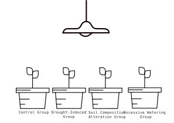
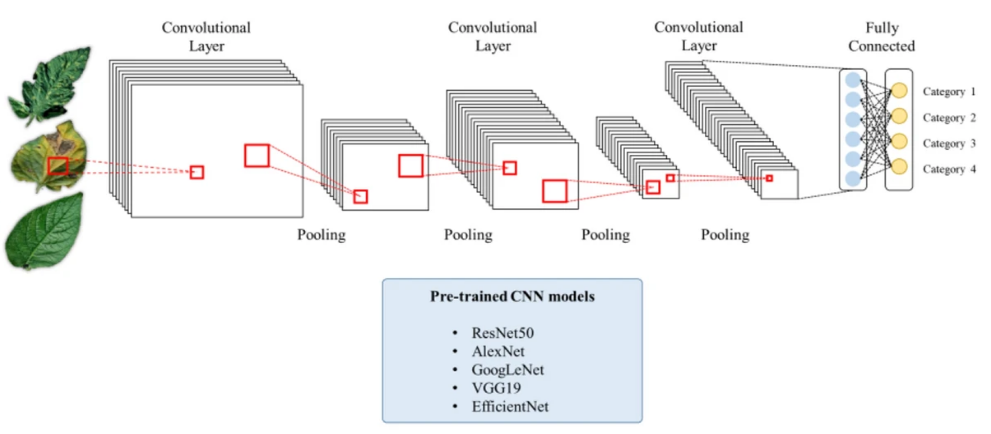
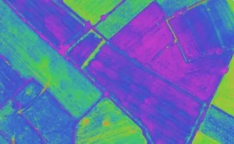
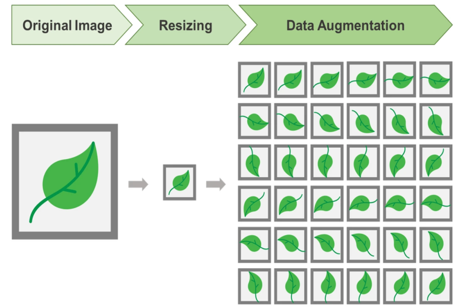
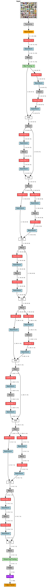
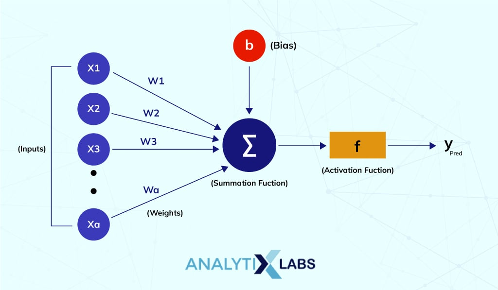

## Abstract

Plant diseases pose a significant problem for agriculture, especially considering the increasing pressure caused by climate change on plants, exposing them to new stressors. These stresses can be triggered by factors like drought, flooding, extreme temperatures, and alterations in soil composition. Within agriculture, these stresses can lead to production losses, decreased product quality, and even plant mortality. Early detection of diseases is crucial to enable farmers to address them before they cause substantial damage.

The use of deep learning, a subset of artificial intelligence (AI), emerges as an effective solution for detecting these plant diseases. By employing Convolutional Neural Networks (CNNs), these networks can identify intricate patterns within images, making them ideal for pinpointing disease symptoms on plant leaves with high precision.

This paper introduces a method for early detection of plant diseases based on deep learning. The aim of this method is to be accessible and user-friendly for farmers. To achieve this goal, the method will be implemented as a web application accessible via a smartphone or tablet equipped with a camera, making this technology available to a larger number of farmers without requiring additional hardware.

In this study, we will conduct experiments on basil plants subjected to various stresses. We will simulate a range of conditions such as drought, flooding, and alterations in soil composition. Photos of the plant leaves at different stress stages will be taken. Subsequently, our deep learning model will be used to predict the type of stress experienced by the plants.

We hope this experiment will demonstrate that our model can accurately predict the stress experienced by the plants before it becomes visible to the naked eye. This capability could enable farmers to take preventive measures to safeguard their crops.

## Introduction
Plant diseases pose a significant challenge to global agriculture, causing substantial losses in production and quality, and even leading to crop failure. The increasing pressure of climate change on plants further exacerbates the issue, exposing them to a wider range of stressors, such as drought, flooding, extreme temperatures, and soil composition changes. These stresses can manifest as visible symptoms on plant leaves, but detection at early stages is crucial for prompt intervention.

Deep learning, a subset of artificial intelligence (AI), has emerged as a powerful tool for early detection of plant diseases. Convolutional Neural Networks (CNNs), a type of deep learning architecture, excel at identifying subtle patterns in images, making them well-suited for pinpointing disease symptoms on plant leaves.

This paper proposes a web application that utilizes deep learning to enable farmers to detect plant diseases early on. The application will be accessible via smartphones or tablets equipped with cameras, making it convenient and accessible to a wider range of farmers.

To evaluate the effectiveness of our method, we will conduct experiments on basil plants subjected to various stresses. We will simulate a range of conditions, including drought, flooding, and alterations in soil composition. Photographs of the plant leaves will be taken at different stress stages. Our deep learning model will then be used to predict the type of stress experienced by the plants.

We anticipate that our deep learning model will accurately predict the stress experienced by the plants even before it becomes visible to the naked eye. This capability would empower farmers to take preventive measures, such as adjusting irrigation schedules or modifying soil nutrients, to protect their crops and minimize losses.

This study has the potential to change the way farmers manage plant diseases, significantly reducing crop losses and improving agricultural productivity. The web application's ease of use and accessibility will make it a valuable tool for farmers worldwide.

Several studies have demonstrated the effectiveness of deep learning for early detection of plant diseases. For instance, Ghasemi et al. (2020) developed a CNN-based model for identifying citrus diseases, achieving an accuracy of over 90%. Similarly, Zhang et al. (2022) employed a deep learning model for detecting rice diseases, achieving a precision of 93.4%.

Our work builds upon these advancements by developing a user-friendly web application for farmers, making deep learning accessible to a wider audience. We aim to address the gap in existing research by demonstrating the ability of our model to predict stress conditions before they manifest as visible symptoms on plant leaves.

## Experimentation Process

The research process on early detection of plant diseases addresses two major objectives:

Development of a deep learning model capable of detecting plant diseases at an early stage, before symptoms are visible to the naked eye.

Evaluation of the accuracy and robustness of the model under various conditions, including drought, flooding, and changes in soil composition.

### Experimental Equipment
The equipment required for the research includes:

- An iPhone 14 equipped with a dual 12 MP primary camera for image capture.
- Basilicum plants of the most common variety known for disease resistance, purchased from commercial sources.
- Nvidia GeForce GTX 4060 Ti GPU with 8GB dedicated memory for training the deep learning model.
- Niello L-LZB1 agricultural LED lamp providing a full spectrum of light for indoor plant growth.

### Procedure

The research unfolds in six distinct phases:

#### Phase 1: Preparation and Growth of Plants
The basil plants are divided into four groups, each representing a different stress condition, such as drought, flooding, and alterations in soil composition. This aims to observe plant reactions and symptoms under stress compared to a control group grown under ideal conditions.

Plants of the same variety are purchased commercially and thus have been grown under identical conditions, using nutrient-rich soil. This approach aims to minimize growth differences by ensuring a uniform growing environment.

The four groups are structured as follows:

- Group 1: Control Group - This group is intended to provide reference images of healthy plants. Basil, being a summer plant, requires substantial water input, so the substrate must remain moist. Thus, daily watering will be performed in the morning at 9 o'clock. Additionally, this plant requires approximately 16 hours of sunlight exposure per day. Hence, the grow light will be turned on to meet this light exposure duration, ensuring the best conditions for this experimental group.

- Group 2: Drought-Induced Group - This group aims to simulate increasingly common drought conditions encountered in crops due to climate change. To replicate this drought, all water supply to the plants will be halted while maintaining the same lighting pattern as the control group.

- Group 3: Soil Composition Alteration Group - The goal here is to simulate soil disturbance. To achieve this, the focus will be on an excessive supply of chelated iron. A solution containing 5 grams of chelated iron diluted in 1 liter of water will be administered daily via drip irrigation to this experimental group, representing five times the recommended dose. This surplus of iron can lead to growth problems, particularly due to the potential toxicity of iron to plants. Water and light supply will remain identical to those of the control group to maintain uniform environmental conditions between experimental groups.

- Group 4: Excessive Watering Group - In this group, irrigation will be tripled compared to the control group, inducing waterlogging to simulate plant drowning. Light exposure will remain similar to that of the control group to maintain consistent lighting conditions.

<p align="center">
  
</p>


#### Phase 2: Data Collection
This phase involves capturing images of basil plants at various stages of their growth. The shots are taken at a standard distance of 30 cm from the plants. The captures are meticulously planned at specific times of the day, namely at 9 am, 12 pm, and 5 pm, to limit external light variations that could disrupt data quality for deep learning model establishment. Furthermore, shots are taken from different angles to comprehensively capture all plant characteristics. This methodical approach aims to ensure consistency in the collected data and guarantee a complete representation of basil specimens for precise analysis by the deep learning model.

#### Phase 3: Data Preparation
The collected photos will be prepared for training the deep learning model. This will include the following steps:

- Data Augmentation: Generating artificial variations in images to increase the size and diversity of the dataset. These operations include random rotation, horizontal/vertical flipping, resizing, random cropping, zooming, and adding noise. This approach aims to avoid excessive similarity between photos, thus simulating different shots, such as those taken by farmers in various conditions, to prevent overfitting.

- Image Normalization: Adjusting brightness, contrast, and color balance in images to minimize variations due to lighting or other environmental factors.

- Image Labeling: Annotating images with information regarding plant health, growth stage, and their respective cultivation groups.

- Dataset Splitting: The dataset will be divided into distinct sets: a training set for model learning, a validation set to adjust model parameters, and a test set to evaluate the final model performance after training.

#### Phase 4: Model Training
A deep learning model will be trained using the prepared data. The choice of a Convolutional Neural Network (CNN) is justified by its ability to efficiently detect patterns in images, which is necessary to identify plant disease symptoms.

To enhance model accuracy and speed, transfer learning techniques are used. This model will be based on the ResNet18 architecture, initially pre-trained on a vast dataset of 1,281,167 object images, providing it with a good understanding of general image features.

Subsequently, the ResNet18 model will be fine-tuned specifically on the training data collected for this research. This fine-tuning process involves adjusting the weights of different layers of the model based on the training data. This adaptation will enable the model to learn specific features of basil images and diseases related to our cultivation groups.

The architecture of the final model will be as follows:

The model will have two fully connected (FC) layers at the end. The first FC layer will have 1024 neurons, and the second FC layer will have 4 neurons, one for each cultivation group class.

ResNet18 (fine-tuned)

├── FC1 (1024 neurons)

└── FC2 (4 neurons)

<p align="center">
  
</p>


#### Phase 5: Model Testing
The deep learning model will be evaluated using data that has not been previously used in its training phase. This approach aims to assess the model's performance, accuracy, and resilience.

#### Phase 6: Deployment on the Web
One of our main goals is to make this technology easily accessible to farmers. Once the deep learning model is trained and tested, we convert it to the ONNX format, making it usable in web scripts and compatible with a wide range of browsers. To host this system, we have chosen to use GitHub Pages, a free hosting solution, thereby offering this technology in a simple and cost-free manner to farmers. This approach aims to make the tool accessible, facilitating its practical use for early detection of plant diseases, thereby benefiting the agricultural community.

## State of the art

### Plant Disease Detection
Effective plant disease detection techniques can be classified into two main categories: non-destructive and destructive techniques.

#### Non-destructive Techniques
- Visual inspection: It involves visually examining plants either with the naked eye or using a camera. This technique is simple and cost-effective but can be subjective and requires human expertise.
- Infrared-based detection: It utilizes differences in infrared reflectance between healthy and diseased tissues. While more objective than visual detection, it requires specialized equipment.
- Spectroscopy: By measuring light absorption in plants, this technique identifies diseases precisely. However, it necessitates expensive equipment.

#### Destructive Techniques
- Microscopy: It allows the observation of disease symptoms at a microscopic level. Though highly accurate, it requires expertise and can be destructive to plants.
- Biochemical tests: These measure chemical concentrations in plant tissues. While quick and inexpensive, they might lack specificity for diseases.

### NDVI and PRI Indices
NDVI (Normalized Difference Vegetation Index): It uses the difference between near-infrared (NIR) and red wavebands to assess plant health. Higher NDVI values indicate healthier plants due to the way healthy plants absorb and reflect light differently from stressed or damaged ones.

PRI (Photochemical Reflectance Index): It gauges plant health by comparing light reflectance at specific wavelengths (531 nm and 570 nm) to estimate chlorophyll content, crucial for photosynthesis and closely correlated with plant health.

Both NDVI and PRI indices are calculated using light reflectance data collected by sensors, often from satellites, airplanes, or drones. However, these means of data collection can be costly for farmers or operators.

<p align="center">
  
</p>

### CNNs and Computer Vision
Convolutional Neural Networks (CNNs) are a type of artificial neural network widely used in computer vision. CNNs excel at image processing by learning to recognize patterns in data. They are applied in image classification, object detection, and image segmentation.

To extract features from an image, a CNN consists of:

1. Convolutional layers: These layers apply filters (kernels) to extract features through convolution operations, identifying specific patterns like edges, textures, or shapes.

2. Pooling layers: Also known as subsampling layers, they reduce spatial dimensionality by selecting the most important features extracted by convolutional layers, often through operations like max pooling or averaging.

#### Network Architectures
Architectures like LeNet, AlexNet, VGG, GoogLeNet (Inception), ResNet, and EfficientNet are commonly used CNN architectures, each with its depth, complexity, and performance characteristics.

Specifically, ResNet introduced residual connections in 2015, addressing the degradation problem in deeper networks by allowing the addition of residual blocks.

#### Transfer Learning
This technique involves using pre-trained models on large datasets like ImageNet. Pre-trained layers can be reused for similar tasks, yielding good results even with smaller datasets.

#### Enhancements and Regularizations
Batch Normalization, Dropout, and data augmentation techniques such as rotation, horizontal/vertical flipping, random cropping, etc., are often used to improve model generalization and prevent overfitting.

<p align="center">
  
</p>

## Process - Development

### Data preparation

Dans le domaine de l'apprentissage profond, la préparation des données est une étape cruciale. Ici, nous allons explorer comment charger les données d'un dataset spécifique, appliquer des techniques de data augmentation et finalement les convertir en tenseurs pour les utiliser avec PyTorch. Nous utilisons ici un dataset de feuilles de pommiers - this dataset comme from this kaggle contest : https://www.kaggle.com/competitions/plant-pathology-2020-fgvc7/overview 

#### Data loading

Le chargement des données commence par l'initialisation de la classe LeafDataset, qui hérite de Dataset de PyTorch. Cette étape est essentielle pour manipuler les données de manière efficace et structurée.

```python
class LeafDataset(Dataset):
```

Dans le constructeur de cette classe, nous allons charger les différentes images du dataset depuis le dossier "dataset/plant-pathology-2020-fgvc7" qui contient toutes les images de train et de test.

Les étiquettes associés a ces différentes images ['healthy', 'scab', 'crop', 'multiple diseases'] sont stockés dans un fichier csv sous le nom "train.csv" que nous devons aussi charger en tant que dataframe_Y. 

```python
self.path = "dataset/plant-pathology-2020-fgvc7"
self.path_dir_X = os.path.join(self.path, 'image')
self.path_Y = os.path.join(self.path, 'train.csv')
self.dataframe_Y = pd.read_csv(self.path_Y)
self.labels = self.dataframe_Y.loc[:, 'healthy':'scab']
```

#### Data augmentation

La data augmentation est une technique pour augmenter artificiellement la diversité des données d'entraînement en les transformant de manière aléatoire et réaliste. Cela améliore la généralisation du modèle pour eviter le sur-apprentissage sur les memes photos.

Techniques Appliquées :

Pour appliquer ces techniques nous utilisons la bibliothéque albumentations.
```python
import albumentations as A
```

- RandomResizedCrop: Cette transformation change aléatoirement la taille et les proportions de l'image. Ici, on redimensionne les images à une taille définie pour assurer la cohérence.
```python
A.RandomResizedCrop(height=height_image, width=width_image, p=1.0)
```
- Rotate: Fait pivoter l'image d'un degré aléatoire pour simuler différentes orientations.
```python
A.Rotate(20, p=1.0)
```
- Flip & Transpose: Applique un retournement horizontal et/ou vertical, et transpose les images, ce qui augmente la variabilité des orientations et des perspectives.
```python
A.Flip(p=1.0)
A.Transpose(p=1.0)
```
- Normalize: Normalise les images pour accélérer la convergence pendant l'entraînement en standardisant les valeurs de pixels.

```python
A.Normalize(p=1.0),
```

<p align="center">
  
</p>

#### Conversion en tenseur

La conversion en tenseurs est une étape fondamentale pour utiliser PyTorch. Les tenseurs sont des structures de données multidimensionnelles optimisées pour les calculs sur GPU, ce qui permet d'accélérer considérablement l'entraînement des modèles. 

De plus, les tenseurs permettent d'exploiter efficacement les fonctionnalités avancées de PyTorch, comme la rétropropagation automatique pour le calcul des gradients - qui sera expliqué plus tard dans ce document.

```python
from albumentations.pytorch import ToTensorV2

ToTensorV2(p=1.0)
```

<p align="center">
  
</p>

#### Récupération images transformées

La méthode __getitem__ est appelée chaque fois qu'on accède à un élément du dataset avec un indice - elle joue un rôle crucial pour intégrer le dataset avec l'écosystème PyTorch, en particulier avec DataLoader(expliqué dans la suite du document) pour le chargement et la manipulation des données lors de l'entraînement des modèles.

Cette méthode retourne donc en fonction d'un indice - une image et son étiquette associée.

```python
def __getitem__(self, index):
    img_name = self.dataframe_Y.loc[index, 'image_id']  
    img_path = f"{self.path_dir_X}/{img_name}.jpg"
    image = plt.imread(img_path
    image = self.transform(image = image)['image']
    label = torch.tensor(np.argmax(self.labels.loc[index,:].values))  #
    return image, label
```

### Model

#### Fonctionnement d'un CNN

Un CNN, ou Convolutional Neural Network, est une technique puissante de l'apprentissage profond (deep learning) utilisée principalement pour la vision par ordinateur, notamment dans la reconnaissance d'images. L'idée de base derrière les CNN est de simuler la manière dont le cerveau humain traite visuellement l'information. 

- Entrée : Un CNN prend une image en entrée. Une image est essentiellement une grille de pixels, où chaque pixel a des valeurs de couleur (rouge, vert, bleu).

- Filtres : Les CNN utilisent des filtres (ou des noyaux) pour extraire des caractéristiques importantes de l'image. Ces filtres sont de petites matrices (par exemple 3x3 ou 5x5) qui se déplacent sur toute l'image. À chaque position, le filtre effectue une opération de convolution qui combine les valeurs de pixels dans sa zone de couverture.

- Cartes de caractéristiques : Les opérations de convolution créent des cartes de caractéristiques, qui sont essentiellement des images modifiées. Chaque carte de caractéristiques met en évidence une caractéristique spécifique de l'image, comme les bords, les coins, ou des motifs plus complexes.

- Couches de pooling : Pour réduire la taille des cartes de caractéristiques et rendre le modèle plus efficace, des couches de pooling sont utilisées. Elles réduisent la résolution des cartes de caractéristiques en conservant les informations essentielles. Le pooling consiste généralement à prendre la valeur maximale (max-pooling) ou la moyenne (average-pooling) dans une petite région de la carte de caractéristiques.

<p align="center">
  
</p>

#### Fine-Tuning


Le fine-tuning est une technique de transfert d'apprentissage qui consiste à utiliser un modèle pré-entraîné pour une tâche spécifique comme point de départ pour un modèle destiné à une autre tâche. Cette approche offre plusieurs avantages, notamment une amélioration des performances de classification finale.  Il a été initialement développé par Microsoft Research et entraîné sur le jeu de données ImageNet, qui contient plus d'un million d'images réparties dans plus de mille catégories différentes. Cela a permis à ResNet-18 (et d'autres architectures ResNet) d'apprendre des caractéristiques générales à partir d'un ensemble de données très vaste et diversifié.

Dans le processus de fine-tuning, les premières couches du modèle pré-entraîné sont figées, ce qui signifie que leurs poids ne sont pas ajustés pendant la phase d'entraînement. Ces couches ont déjà acquis la compétence d'extraire les caractéristiques générales des images.

Ici nous utiliserons RESNET18 pour cette partie de finne tunning qui remplace donc la couche CNN.

ResNet-18 est une architecture de réseau de neurones profonds très populaire, faisant partie de la famille des réseaux résiduels (ResNets). Il a été introduit par Microsoft Research en 2015.

ResNet-18 est composé de 18 couches de convolution, d'opérations de normalisation, et de couches de pooling. C'est une architecture profonde, mais plus légère que d'autres variantes de ResNet.

<p align="center">
  
</p>

#### Fully Connected layer

Après le passage de l'image à travers les couches de convolution et de pooling, les couches fully connected (ou denses) jouent un rôle crucial dans la classification finale dans les réseaux de neurones convolutifs (CNN).

##### Concept de perceptron 

Les couches fully connected sont composées de perceptrons, qui sont les unités de base d'un réseau de neurones. Un perceptron fonctionne de la manière suivante :

- Entrées Multiples : Chaque perceptron reçoit plusieurs entrées. Dans le contexte d'un CNN, ces entrées sont généralement les caractéristiques aplaties extraites des couches précédentes.

- Poids : Chaque entrée est pondérée par un poids spécifique. Ces poids sont des paramètres apprenables qui sont ajustés pendant le processus d'entraînement.

- Somme Pondérée : Le perceptron calcule la somme pondérée de ses entrées.

- Fonction d'Activation : La somme pondérée est ensuite passée à travers une fonction d'activation, qui peut être non-linéaire, comme la fonction ReLU (Rectified Linear Unit) ou la fonction sigmoïde. Cette fonction d'activation aide à introduire de la non-linéarité dans le modèle, permettant au réseau de capturer des relations complexes dans les données.

- Sortie : Le résultat est une sortie unique du perceptron, qui est ensuite transmise à d'autres neurones ou utilisée pour la classification finale.


<p align="center">
  
</p>


